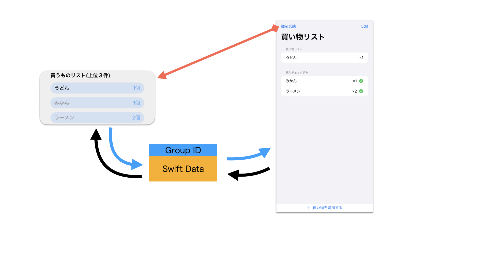

# iOS-WidgetButtonSample
  
iOS 17以降で利用可能なAppIntentとWidgetKitを活用した、買い物リスト管理アプリのサンプルです。
本体アプリとウィジェットは SwiftData を使用してデータを共有し、ウィジェット上でもアイテムのチェック操作が可能です。

## 使用イメージ
  
by ChatGPT

## 環境
- Xcode 16.3  
- iOS 18.3  
- グループID使用のためapple developer契約(有料)が必要 多分・・。  
  
## サンプルアプリの説明

本アプリでは、買い物リストの管理と購入チェック機能を提供します。  
アイテムは購入済み・未購入に分けて表示され、タップ操作で購入状態を切り替えることができます。  
本体アプリとウィジェットは SwiftData + App Group を通じて買い物リストを連携しており、  

### 本体アプリの主な機能

- アイテムの追加・削除・並び替え  
- タップ操作で購入状態の切り替え

### ウィジェットの主な機能

- 本体アプリでユーザーが並べ替えた順に従って、最大3件のアイテムを表示  
- タップ操作で購入状態を切り替え可能  
- 購入済みのアイテムは取り消し線で表示される  
- 状態変更後は自動で再描画される
